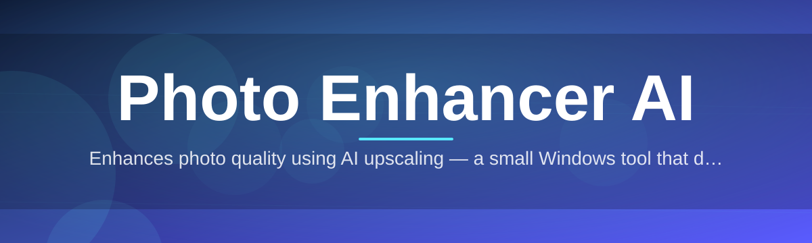
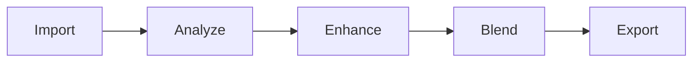

# photo-ai-enhancer ✨🖼️

  

*Turn tired, muddy photos into crisp, gallery-ready images with one click.*

  

## 🌤️ Overview

Every photo library has that folder — the one full of blurry scans, underexposed portraits, and phone shots ruined by bad lighting. **photo-ai-enhancer** exists because most people don't want to learn color theory or masking layers just to fix grandma's old wedding photo or salvage a screenshot that got compressed into oblivion. It's a Photo Enhancer AI built for Windows that takes the guesswork out of restoration and enhancement, wrapping a genuinely capable neural pipeline inside an interface anyone can pick up in under a minute.

Under the hood, this is a **photo enhancer AI** in the truest sense — not a set of Instagram-style filters, but a stack of dedicated models trained for specific problems: noise, blur, low resolution, faded color, and poor lighting. Each one does a narrow job extremely well, and the app decides which combination to apply based on what it detects in your image. The result feels less like "applying a filter" and more like handing your photo to a very patient restoration artist who never gets tired.

Who's this for? Photographers cleaning up a shoot before a client delivery, family archivists digitizing decades of prints, small businesses touching up product photos, or anyone who just wants their camera roll to look like it was shot on better equipment than it actually was. If you've ever thought "this photo could be so much better if it was just... sharper," this tool was built with exactly that sentence in mind.

---

## 🔧 What It Actually Does

> [!TIP]
> You don't need to know which tool does what — the app auto-detects the right fix. But here's the breakdown for the curious.

- **Detail Recovery Engine** — reconstructs edges and fine texture lost to compression or low resolution, without the plastic "over-sharpened" look.

- **Adaptive Denoising** — strips grain and sensor noise from low-light shots while protecting skin tones and soft gradients from going flat.

- **Face-Aware Enhancement** — recognizes facial regions and applies gentler, more precise correction there than on backgrounds, so portraits stay natural.

- **Dynamic Color Restoration** — revives faded, yellowed, or washed-out colors in old scans and prints, matching a believable, non-cartoonish palette.

- **Smart Upscaling** — enlarges images up to 4x while inventing plausible detail rather than just stretching pixels.

- **Batch Processing Queue** — load a folder, walk away, come back to a folder full of finished photos.

- **Before/After Compare Slider** — a draggable divider so you can see exactly what changed, pixel by pixel.

- **Non-Destructive Workflow** — your original file is never overwritten unless you explicitly say so.

> [!NOTE]
> All processing happens locally on your machine. Nothing gets uploaded anywhere — your photos stay yours.

---

## 🚀 Getting Started

1. Head to the landing page using the download button above.

2. Grab the latest Windows build — it's a single standalone package, no installer wizard maze.

3. Launch the app and drop in a photo (or a whole folder) via drag-and-drop or the **Open** button.

4. Pick an enhancement mode, hit **Enhance**, and export when you're happy with the preview.

> [!TIP]
> First time using it? Start with a single photo before running a full batch — it helps you get a feel for how strong each mode is.

---

## 💻 System Requirements

  

| Requirement | Minimum | Recommended |
|---|---|---|
| OS | Windows 10 (64-bit) | Windows 11 |
| RAM | 4 GB | 8 GB or more |
| Storage | 500 MB free | 2 GB free (for batch caching) |
| GPU | Not required | Dedicated GPU speeds up large batches |
| Dependencies | None — fully standalone | — |

> [!IMPORTANT]
> No runtime, framework, or extra download is needed. The app ships as one self-contained package for Windows.

---

## 🧠 How It Works

The pipeline is intentionally simple to reason about, even though what happens inside each step is fairly involved:

1. **Ingest** — the app reads your image and profiles it (resolution, noise level, lighting, presence of faces).

2. **Route** — based on that profile, it selects which enhancement models apply, and in what order.

3. **Enhance** — the selected models run in sequence, each refining what the previous one produced.

4. **Reassemble** — corrected regions (faces, edges, color) are blended back into a single coherent image.

5. **Deliver** — you get a preview with the compare slider, and can export once you're satisfied.

---

## 🩺 Troubleshooting

<strong>My exported photo looks over-processed or too smooth.</strong>

Lower the enhancement intensity slider before exporting — the default profile is tuned for average photos, but very clean images need a lighter touch.

<strong>Batch mode seems to be stuck on one file.</strong>

Very large images (over ~40 megapixels) take noticeably longer. Check the progress bar text — if it's still incrementing, it's working, just slowly.

<strong>Faces in group photos aren't enhanced as well as solo portraits.</strong>

Small or partially obscured faces are harder to detect confidently. Try cropping tighter around the group before enhancing for better results.

<strong>The app won't launch after downloading.</strong>

Make sure Windows didn't quarantine the file — check your browser's downloads bar or Windows Defender's protection history and allow it through.

<strong>Colors look different from the original photo.</strong>

That's usually the Dynamic Color Restoration module working on faded scans. You can disable it per-photo if you want to preserve the original palette exactly.

---

## 🎨 UI / UX Details

> The interface leans minimal on purpose — one main canvas, one side panel, no buried menus.

**Keyboard shortcuts:**

| Action | Shortcut |
|---|---|
| Open image | `Ctrl + O` |
| Export result | `Ctrl + S` |
| Toggle before/after | `Space` |
| Undo last enhancement | `Ctrl + Z` |
| Open batch queue | `Ctrl + B` |

- **Themes** — Light and Dark, switchable from Settings, both designed to keep color judgment accurate on screen.

- **Compare slider** — click-drag anywhere on the canvas to reveal before/after in real time.

- **Settings panel** — control default enhancement strength, output format, and whether originals are auto-backed-up.

---

## 🤝 Contributing & Community

This project grows because people using it care enough to report what's broken and suggest what's missing.

- Found a bug? Open an issue with a sample image (if you're comfortable sharing) and steps to reproduce.

- Have an idea for a new enhancement mode? Feature requests are always welcome in Discussions.

- Want to contribute code? Fork the repo, make your changes on a branch, and open a pull request describing what and why.

> [!WARNING]
> Please don't submit copyrighted or private photos as issue attachments — use sample or royalty-free images when reporting visual bugs.

---

## 📄 License

Released under the [MIT License](LICENSE), 2026. Use it, adapt it, ship it — just keep the license notice intact.

---

## ⚠️ Disclaimer

photo-ai-enhancer is provided "as is," without warranty of any kind. Enhancement results are generated automatically and may vary depending on source image quality; the tool does its best but cannot guarantee a specific outcome for every photo. Always keep a backup of your original files before running batch operations.

